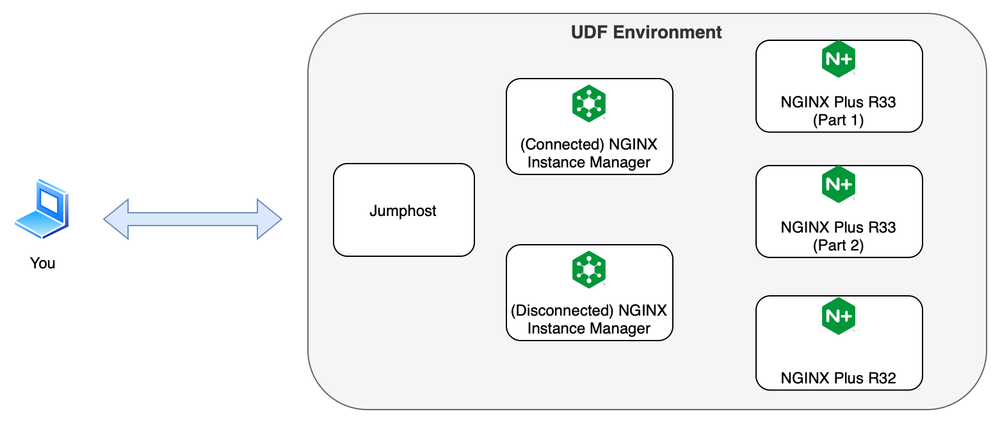

## Welcome

Welcome to the NGINX Plus R34 Upskill Lab.

### Agenda

Insert-generic-agenda-outline-here.

---

## NGINX Plus R34

This release brings in major changes to help reduce friction and increase adoption of NGINX features like entitlement and visibility, OpenID connect and HTTP/3+QUIC support. This release also packs in a number of other enhancements like support for Early Hints, improvements to the OTEL traces implementation along with bug fixes. With this release, all NGINX customers who cannot point their NGINX instances to F5 licensing endpoint directly would now have the option to send usage telemetry to F5 via their preferred forward proxy solution in their environment. Similarly, most NGINX customers leveraging the OpenID connect module today would benefit from the simplification in the configurability and performance gains getting delivered by making OIDC module a native NGINX Plus module. This release also introduces initial support for Early Hints which improves overall customer experience by reducing their website(application) load times, along with bringing more clarity into upstream performance for customers using NGINX Plus health check module.

### Background

Insert-reference-to-r33-upskilling and licensing information here.

## Upskill session layout

In these sessions, we are breaking the labs into into the following sections below.

- Demo
- Interactive
- Fix It

### Demo

You watch a video where we show you one way of configuring the endpoint on the NGINX instance to an F5 License
Endpoint where the NGINX instance has internet connectivity.

### Interactive

This lab has 2 parts where you will setup the NGINX instance uses NIM as the usage report endpoint.
- The first part has NIM in an environment with internet access
- The second part has NIM in a network restricted environment. We  will go through the steps of setting up and manually
submitting the usage report because both the NGINX instance and NIM do not have internet access.

### Fix it

The last portion will be the Fix It Lab where you do an upgrade from NGINX Plus R32 to R34.

### Environment

The diagram of the lab environment is shown below.

This UDF Blue Print contains the following systems.
1. Jumphost
1. NGINX Plus Instance R34 (for interactive lab part 1)
1. NGINX Plus Instance R34 (for interactive lab part 2)
1. (Connected) NGINX Instance Manager 2.18
1. (Disconnected) NGINX Instance Manager 2.18
1. NGINX Plus Instance R32 (for R32 to R34 upgrade)

> :warning: **Note:** The UDF environment does not support a true disconnected environment. So when we do the
interactive lab, we will go through steps as if NGINX Plus and NIM are fully disconnected to the internet but do note
they have internet connectivity.

---

## Use Cases

For the NGINX Plus R34 release, the following use cases will be covered here:

1. Support for forward proxy for NGINX usage telemetry transmission to F5
2. Enhanced logging for health check failures
3. Native implementation of OpenID Connect
4. Support for Early Hints (RFC 8297)
5. Support for CUBIC congestion algorithm in HTTP/3+QUIC

---

## Additional information

We are basing most of the information of this lab from the following sources.
- [NGINX Plus R34 Pre-release Guidance](https://docs.nginx.com/solutions/)
- [NGINX Plus R34 Subscription License](https://docs.nginx.com/solutions/about-subscription-licenses/)
- [NIM - Offline Installation](https://docs.nginx.com/nginx-instance-manager/disconnected/offline-install-guide/)
- [NIM - Offline License and Activation](https://docs.nginx.com/nginx-instance-manager/disconnected/add-license-disconnected-deployment/)
- [NIM - Report Usage Offline](https://docs.nginx.com/nginx-instance-manager/disconnected/report-usage-disconnected-deployment/)

## Up next

Insert-next-blurb [clicking here](r34-2.mdx).
