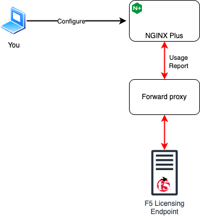
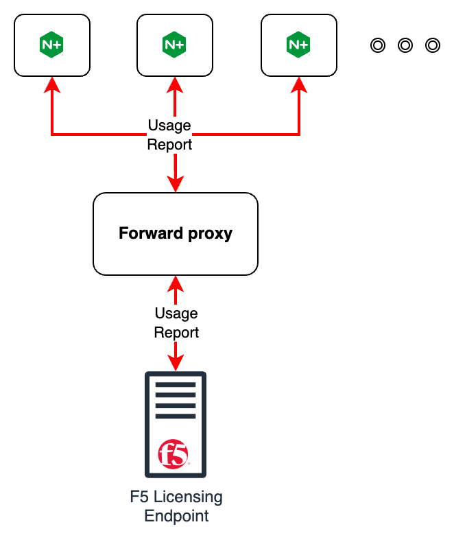

## Introduction

This demo illustrates configuring NGINX Plus R34 to transmit Entitlement & Viability (E&V) data to F5 through an
existing **forward proxy**. Below shows where you will be doing most of the interaction in this lab.



### E&V on NGINX Plus R33

Before we continue, let's take a step back when E&V was first introduced on NGINX Plus R33. That was the first
version where it is required to report E&V to F5. You had two endpoint options to use.

1. F5 Licensing Endpoint
   - Requires internet connectivity to this server from all NGINX Plus instances.
1. NGINX Instance Manager (NIM)
   - Your NGINX Plus instances must remain behind your firewall or must not be allowed to access the internet

If you want to use NIM as the E&V endpoint, there are two sub-options.

1. NIM has internet connectivity and directly connects to the F5 Licensing Endpoint
1. Your environment is air-gapped and you must download/upload the E&V report to to F5

One incoming request is customers do not want to use any options provided by R33 but would rather use their own
**forward proxy** instead. So this is what R34 is addressing for this use case, being able to fulfill E&V using a
forward proxy.

Below is a diagram showing an example environment of how this would look like.



### Forward Proxy

The forward proxy is an existing piece thats already installed. If you are interested you can expand the box
below.

<Collapsible title="HTTP Forward Proxy Details">

:exclamation: **NO ACTION NEEDED, INFO ONLY**:exclamation:

We are using a simple lightweight proxy called [tinyproxy](https://tinyproxy.github.io) to act as a forward proxy in
this portion of the lab. Take a look at the following instruction below if you are interested in bringing up this in
your own environment.

1. Install **tinyproxy**

   ```shell
   sudo apt install tinyproxy
   sudo systemctl enable tinyproxy
   ```

1. Update the **tinyproxy** config file located at `/etc/tinyproxy/tinyproxy.conf` so that it allows forward proxy'ing
   from our Management network. A snippet below is an example where we do this.

   ```shell
   #
   # Allow: Customization of authorization controls. If there are any
   # access control keywords then the default action is to DENY. Otherwise,
   # the default action is ALLOW.
   #
   # The order of the controls are important. All incoming connections are
   # tested against the controls based on order.
   #
   Allow 127.0.0.1
   Allow ::1
   Allow 10.1.1.0/24  # <--- Added Management Subnet
   ```

1. Finally restart **tinyproxy** to reload the config.

   ```shell
   sudo systemctl restart tinyproxy
   ```

</Collapsible>

Let's now proceed to the lab portion of this use case!

## Demo lab

Most of the steps here will be done on the **NGINX Plus R34 (Part 1)** system in UDF. If you do not already have a
connection opened up for that system, follow the steps below.

1. Log into [UDF](https://udf.f5.com)
1. Go to your **SDE NGINX Plus R34 Upskilling** Deployment
1. Look for **NGINX Plus R34 (Part 1)** under System
1. Select **ACCESS** to open up a menu showing access options
1. Select **SSH** or **WEB SHELL**

### NGINX Plus Instance

Below are some details of this instance.

This instance is configured such that it cannot reach **product.connect.nginx.com** to simulate an air-gap or a
firewall. This is done from an entry in `/etc/hosts` where I configure that hostname to a dummy IP address **1.1.1.1**.

NGINX Plus R34 is already installed but the "Forward Proxy" configuration is not completed.

When you look at the NGINX error logs, you will see a line indicating an error when trying to report to the
`product.connect.nginx.com` which resolves to a dummmy IP.

<Collapsible title="NGINX E&V Connection Error Output">

```shell
ubuntu@plus1:~$ sudo cat /var/log/nginx/error.log
2025/05/07 06:13:37 [error] 686#686: connect() timed out during usage report to 1.1.1.1:443
2025/05/07 06:13:37 [alert] 686#686: cannot send usage report; traffic processing will degrade in 178 days
```

</Collapsible>

### Configuration (Forward Proxy)

Again, a forward proxy is already configured at **forward-proxy.local**, listening on port **8888**.

Now let's go ahead and configure this instance to use this forward proxy. Add the following line to the **mgmt** section
in the `/etc/nginx/nginx.conf` file:

```shell
   proxy forward-proxy.local:8888;
```

You may also want to increase the `interval` so NGINX Plus tries to submit the E&V report more often
to increase the error log verbosity in this lab. Below is a snippet of setting the **interval** parameter.

```shell
    usage_report endpoint=product.connect.nginx.com interval=5s;
```

You can take a look at the **mgmt** example config below.

<Collapsible title="Example of Full NGINX Config">

```shell
mgmt {
    # Uncomment to change default reporting values
    usage_report endpoint=product.connect.nginx.com interval=5s;
    license_token /etc/nginx/license.jwt;

    # Set to 'off' to begin the 180-day reporting enforcement grace period.
    # Reporting must begin or resume before the end of the grace period
    # to ensure continued operation.
    enforce_initial_report on;

    # Set to 'off' to trust all SSL certificates (not recommended).
    # Useful for reporting to NGINX Instance Manager without a local PKI.
    #ssl_verify on;

    proxy forward-proxy.local:8888;
}
```

</Collapsible>

Restart NGINX Plus R34:

```shell
sudo systemctl restart nginx
```

You can now confirm success in the NGINX Error log:

```shell
sudo tail /var/log/nginx/error.log
```

Notice the following log message which indicates the report being sent.

```shell
. . .
2025/03/25 17:15:15 [info] 1029#1029: usage report was sent
```

You can also view an example of the full output from the NGINX error logs below.

<Collapsible title="Example output">

```shell
ubuntu@plus1:~$ sudo tail /var/log/nginx/error.log

025/03/25 17:15:15 [notice] 1027#1027: using the "epoll" event method
2025/03/25 17:15:15 [notice] 1027#1027: nginx/1.27.4 (nginx-plus-r34)
2025/03/25 17:15:15 [notice] 1027#1027: built by gcc 11.4.0 (Ubuntu 11.4.0-1ubuntu1~22.04)
2025/03/25 17:15:15 [notice] 1027#1027: OS: Linux 6.8.0-1024-aws
2025/03/25 17:15:15 [notice] 1027#1027: getrlimit(RLIMIT_NOFILE): 1024:524288
2025/03/25 17:15:15 [notice] 1028#1028: start worker processes
2025/03/25 17:15:15 [notice] 1028#1028: start worker process 1029
2025/03/25 17:15:15 [notice] 1028#1028: start worker process 1030
2025/03/25 17:15:15 [info] 1029#1029: usage report was sent
```

</Collapsible>

## Up Next

In addition to the forward proxy use case, SSL certificate caching will be demonstrated in the [next section](r34-3.mdx).
