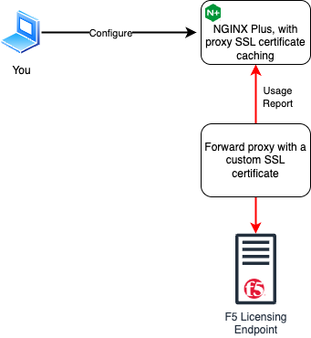

## Introduction

This demo illustrates an example configuration for SSL certificate caching
support that is further extended in the R34 release. This builds on the
previously added SSL certifcate caching support that was added in 2024.
Blog post:
<https://blog.nginx.org/blog/optimizing-resource-usage-for-complex-ssl-configurations>.



## Demo Lab

This demo video will show the following parts:

1. Configure NGINX Plus to cache static SSL certificates.
1. Configure NGINX Plus to cache dynamic SSL certificates with variables.
1. Configure NGINX Plus to turn off inheritance between the configuration cycles
1. Confirm that caching and inheritance are working as expected.

<br/>

Click on the link below which will take you to the demo video.

[Demo: NGINX R34 SSL Certificate Caching](https://f5u.csod.com/REPLACE-WITH-ViDEO-LINK)

> You must be logged into [LearnF5](https://f5u.csod.com/) to access it.

### New Directives

The following new directives were added for SSL Certificate Caching in this
release:

- `ssl_object_cache_inheritable`
- `ssl_certificate_cache`
- `proxy_ssl_certificate_cache`
- `grpc_ssl_certificate_cache`
- `uwsgi_ssl_certificate_cache`

## NGINX SSL Certificate Caching Configuration

NGINX 1.27.4 introduced significant optimizations for handling SSL certificates, aimed at reducing configuration load times and improving resource usage for complex SSL configurations. This training will focus on:

1. How SSL certificate caching works.
1. Key improvements in NGINX 1.27.4.
1. Steps to configure and demonstrate the feature.

---

### Key Concepts

#### 1. What is an SSL Context?

- An **SSL context** (`SSL_CTX`) in NGINX represents the structure created by OpenSSL to store SSL certificates, private keys, and other cryptographic settings needed for TLS/SSL communication.
- Creating an SSL context can be **computationally expensive**, especially with multiple server blocks, large configurations, or repeated file accesses.

---

### 2. How Did SSL Handling Work Before?

- In previous versions of NGINX, nested location blocks or server blocks would often re-create SSL contexts if they defined slight differences in configuration (e.g., different `proxy_ssl_certificate`).
- For configurations with **thousands of locations** or **dynamic certificates**, this led to:
  - Increased memory usage.
  - Longer load and reload times.

---

### 3. What Changed in NGINX 1.27.4?

#### Key Improvements

1. **Caching During Configuration Load:**
   - Certificates, keys, and SSL objects are cached in memory during configuration parsing or reloads. This avoids repeatedly reading the same certificate files from disk.

1. **Selective SSL Context Reuse:**
   - SSL contexts are shared between parent and child blocks unless conflicting settings are detected.

1. **Dynamic Certificate Caching:**
   - Cache dynamically loaded certificates (e.g., `$ssl_server_name`) to mitigate runtime loading costs for multi-domain setups.

---

### 4. Benefits of SSL Certificate Caching

- Faster NGINX **reloads**: Only changed objects are revalidated or reloaded.
- Reduced **memory usage**: Certificates and keys are cached in memory and reused instead of being re-parsed.
- Optimized for dynamic certificates: Improves performance for multi-domain setups.

---

### Configuring SSL Certificate Caching

### 1. Configuration for Static SSL Certificates

Static SSL certificates (full paths specified in `ssl_certificate` and `ssl_certificate_key`) benefit automatically from the caching optimizations introduced in NGINX 1.27.4.

#### Example Configuration: Static Certificates

```nginx
http {
    # Set object cache inheritance and caching behavior
    ssl_object_cache_inheritable off; # Optional: Disable cache inheritance for reloads

    server {
        listen 443 ssl;
        server_name example.com;

        # Static certificates
        ssl_certificate /etc/nginx/ssl/fullchain.pem;
        ssl_certificate_key /etc/nginx/ssl/privkey.pem;

        location / {
            root /var/www/html;
            index index.html;
        }
    }
}
```

### **Key Points:**

#### **Static Certificates (Full Paths)**

- These certificate files (`fullchain.pem` and `privkey.pem`) are cached during the configuration cycle.

#### **Try it out**

1. Remove the certificate files after starting NGINX:

   ```bash
   sudo rm /etc/nginx/ssl/fullchain.pem
   ```

1. Observe that the server continues responding due to cached SSL contexts.
1. Reload NGINX:

   ```bash
   sudo systemctl reload nginx
   ```

Observation: Reload fails because the configuration checks for physical file availability.

### Configuration for Dynamic Certificates with Variables

#### Use Case

Multi-domain servers with certificates generated or mapped dynamically based on `$ssl_server_name`.

#### Example Configuration: Dynamic Certificate Loading

```nginx
http {
    ssl_certificate_cache max=64 inactive=30s valid=5m; # Enable caching for dynamic certificates

    server {
        listen 443 ssl;
        server_name lab.sslcaching.f5npi.net.net;

        # Dynamically load certificates based on $ssl_server_name
        ssl_certificate /etc/nginx/ssl/$ssl_server_name.crt;
        ssl_certificate_key /etc/nginx/ssl/$ssl_server_name.key;

        location / {
            root /var/www/html;
            index index.html;
        }
    }
}
```

#### Key Points

- **Directive**:
  - `ssl_certificate_cache` enables caching for dynamic certificates (`$ssl_server_name`), ensuring subsequent requests reuse cached certificates instead of reloading them.

- **Caching Parameters**:
  - `max=64`: Cache up to 64 SSL certificates or keys.
  - `inactive=30s`: Cached objects not used for 30 seconds are marked as inactive.
  - `valid=5m`: Objects remain valid for 5 minutes before being revalidated.

#### Test Static Certificate Caching

1. **Set Up**:
   - Configure a static HTTPS server using certificate files.

1. **Send a Request**:

   ```bash
   curl -v https://sslcaching.lab.f5npi.net
   ```

1. **Remove Certificates:**

   ```bash
   sudo rm /etc/nginx/ssl/fullchain.pem
   sudo rm /etc/nginx/ssl/privkey.pem
   ```

1. **Observe Behavior**
   - The server continues responding because NGINX is using the cached SSL context.

1. **Reload NGINX:**

   ```bash
   sudo systemctl reload nginx
   ```

**Observation**: Reload fails due to missing certificates.

#### Test Dynamic Certificate Caching

1. **Set Up**:
   - Configure dynamic SSL loading using `$ssl_server_name`.

1. **Prepare Certificates**:
   - Create certificates for `sslcaching.lab.f5npi.net`.

1. **Test with** `curl`:

   ```bash
   curl https://sslcaching.lab.5npi.net # Use the -v option in curl to see more detail on the SSL handshake
   ```

1. **Observe Behavior:**
   - Verify cached certificate loading and reuse. Verify once the valid time expires that NGINX attempts to read the certificates from disk.

### Best Practices

- Use `ssl_certificate_cache` for dynamic, high-scale setups to optimize performance by caching SSL certificates and keys in memory.

- Enable `ssl_object_cache_inheritable off` if you want the SSL certificate cache to be cleared during reloads, ensuring no objects are inherited between configuration reloads.

- Test configuration changes carefully using:

   ```bash
   sudo nginx -t
   ```

### Conclusion

- **SSL caching** improves performance by reducing redundant certificate loads.
- NGINX 1.27.4 introduces enhancements for both static and dynamic setups.
- These optimizations significantly improve resource efficiency during configuration reloads and HTTPS request handling.
- Leverage these techniques to better manage SSL certificates in high-scale environments.

### Up Next

The next section will cover the Native OIDC implementation included in R34.
