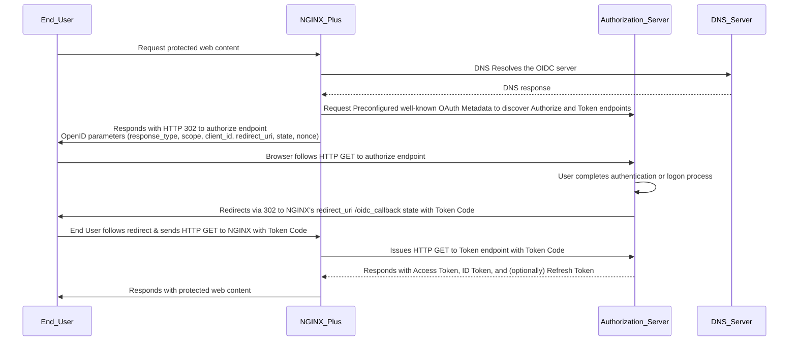

## Introduction

NGNIX Plus r34 includes a new native [OpenID Connect](https://openid.net/developers/how-connect-works/) implementation.

This new implementation is intended to replace the NGINX Inc [nginx-openid-connect Reference Implementation](https://github.com/nginxinc/nginx-openid-connect) with a native and supported solution. NGINX Plus's simplified OIDC Client architecture includes aspects of an *OpenID Connect Client* together with aspects of a *Resource Server*. By combining these roles into a single architecture with shared data, far fewer cryptographic operations are required when compared to a typical OpenID Connect + OAuth system with separated roles.


This document discusses the purpose of the feature and provides information for implementors and engineers supporting it.


## What does this feature do?

This feature allows NGINX Plus to **authenticate** users and **obtain claims data** via an OpenID Connect Authorization Server (AS).

For example, the website or proxy owners may want to enforce a logon from Azure, Okta, Duo, or other OpenID Connect AS before accessing protected content. The site owners may also wish to operate on user information ([claims](https://auth0.com/docs/secure/tokens/json-web-tokens/json-web-token-claims)) provided by the OpenID Connect AS, such as the user's name, email address, profile picture, group data, and the like.

The feature is required for web-based federated OAuth logins because browsers do not support OpenID Connect directly. Instead, a web site or app must behave as a *proxy* for this access on the browser's behalf. Typically the OpenID Connect Client provides an [HTTP Cookie](https://developer.mozilla.org/en-US/docs/Web/HTTP/Guides/Cookies) to track the browser's session and correlate it with OAuth session data on the server side. Because the provider's Authentictaion Server and the user's browser communicate independently of NGINX Plus, the provider is free to implement auth of their choice. In this way, NGINX Plus' OIDC Client and the user's browser operate harmoniously to achieve a trouble-free logon experience.

&nbsp;


## Further Reading

* Module Documentation: [ngx_http_oidc_module](https://nginx.org/en/docs/http/ngx_http_oidc_module.html)
* Admin Guide: [Single Sign-On with OpenID Connect and Identity Providers](https://docs.nginx.com/nginx/admin-guide/security-controls/configuring-oidc/)
* Deployment Guide: [Single Sign-On With Auth0](https://docs.nginx.com/nginx/deployment-guides/single-sign-on/auth0/)
* Deployment Guide: [Single Sign-On with Amazon Cognito](https://docs.nginx.com/nginx/deployment-guides/single-sign-on/cognito/)
* Deployment Guide: [Single Sign-On with Microsoft Active Directory Federation Services](https://docs.nginx.com/nginx/deployment-guides/single-sign-on/active-directory-federation-services/)
* Deployment Guide: [Single Sign-On with Microsoft Entra ID](https://docs.nginx.com/nginx/deployment-guides/single-sign-on/entra-id/)
* Deployment Guide: [Single Sign-On with Keycloak](https://docs.nginx.com/nginx/deployment-guides/single-sign-on/keycloak/)
* Deployment Guide: [Single Sign-On with OneLogin](https://docs.nginx.com/nginx/deployment-guides/single-sign-on/onelogin/)
* Deployment Guide: [Single Sign-On with Okta](https://docs.nginx.com/nginx/deployment-guides/single-sign-on/okta/)
* Deployment Guide: [Single Sign-On with Ping Identity](https://docs.nginx.com/nginx/deployment-guides/single-sign-on/ping-identity/)

&nbsp;

## Architecture

The sections below assume familiarity with OAuth, OpenID Connect, and associated web technologies.

It may be easiest to understand this feature by contrasting it with a typical distributed system made of separate parts.

&nbsp;

### Typical OpenID Connect Architecture

* User: User's web browser
* Resource Server: Validates Tokens, Operates on Token Claim Data, Provides Browser-based App Experience
* OpenID Connect Client: Validates Authentication Server, Obtains Tokens 
* Authentication Server: Provides HTTPS, Provides Tokens, Provides Browser-based User Logon Experience

In a typical client architecture, the *Resource Server* and the *OpenID Connect Client* are two separate components that do not share a datastore. The OpenID Connect Client authenticates the Authentication Server using a standard HTTPS connection. The Resource Server then authenticates the Authentication Server indirectly by cryptographic validation of JSON Web Tokens provided by the OpenID Connect Client with JSON Web Keys provided by the Authentication Server. This indirection provides JWT portability, but incurs additional configuration overhead and computational complexity. 


### NGINX OpenID Connect Client Anchitecture

* User: User's web browser
* NGINX Plus: Validates Authentication Server, Obtains Tokens, Operates on Token Claim Data, Provides Browser-based App Experience
* Authentication Server: Provides HTTPS, Provides Tokens, Provides Browser-based User Logon Experience

NGINX Plus' combined system establishes the root of trust using the Authentication Server's certificate in the HTTPS connection during retrieval of the [well-known OAuth metadata](https://datatracker.ietf.org/doc/html/rfc8414) and the subsequent retrieval of the JWT ID Token and Bearer Token. Because the tokens are stored and operated on inside NGINX Plus itself, they do not require additional validation by an external Resource Server. The user's session is tracked using a standard HTTP cookie, and the authenticated JWTs are used during the session. 


### NGINX Plus OpenID Connect Client Data Flow

This diagram illustrates a typical user logon.



---


### What features are missing that may be expected?

The initial implementation of this feature in R34 is missing the following items that may limit deployment:

* Proof of Key Code Exchange [PKCE](https://www.rfc-editor.org/rfc/rfc7636.html) support. Administrators must preconfigure a 
Client Secret to bypass this limitation. This type of configuration known as a "private app" or "confidential client", 
as opposed to a "public client" which does not require a pre-shared client secret.
* Logout Support. NGINX's OIDC Client tracks user sessions with a session cookie. There is no built-in mechnaism to terminate or invalidate these user sessions.
* Static Session Lifetime. NGINX's OIDC Client uses its own ```session_timeout``` parameter rather than that provided by the Authorization Server in the ID Token, Access Token, or the ```token``` endpoint response's ```expires_in``` parameter.
NGINX  
* JWT Signature Validation. NGINX Plus's OIDC Client establishes trust by validating the SSL certificate of the Authorization Server rather than validating the signatures of the JWTs themselves against a JWK.


## Interoperability

NGINX Plus team have created deployment guides for various 3rd party IdPs including Amazon Cognito, Auth0, Microsoft AD FS, Azure/Entra ID, Keycloak, etc:

**[Single Sign-On with OpenID Connect and Identity Providers](https://docs.nginx.com/nginx/admin-guide/security-controls/configuring-oidc/)**


## Use Case Demo: Configure OpenID Connect in the Lab

# FIXME: Add UDF Lab Demo Content Here