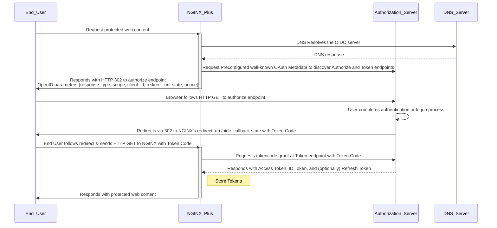

## Introduction

NGNIX Plus r34 includes a new native [OpenID Connect](https://openid.net/developers/how-connect-works/) implementation.

This new implementation is intended to replace the NGINX Inc [nginx-openid-connect Reference Implementation](https://github.com/nginxinc/nginx-openid-connect) with a native and supported solution. NGINX Plus's simplified OIDC Client architecture includes aspects of an *OpenID Connect Client* together with aspects of a *Resource Server*. By combining these roles into a single architecture with shared data, far fewer cryptographic operations are required when compared to a typical OpenID Connect + OAuth system with separated roles.


This document discusses the purpose of the feature and provides information for implementors and engineers supporting it.


## What does this feature do?

This feature allows NGINX Plus to **authenticate** users and **obtain claims data** via an OpenID Connect Authorization Server (AS).

For example, the website or proxy owners may want to enforce a logon from **Azure**, **Okta**, **Duo**, or other **OpenID Connect AS** before accessing protected content. The site owners may also wish to operate on user information ([claims](https://auth0.com/docs/secure/tokens/json-web-tokens/json-web-token-claims)) provided by the OpenID Connect AS, such as the user's name, email address, profile picture, group data, and the like.

The feature is required for web-based federated OAuth logins because browsers do not support OpenID Connect directly. Instead, a web site or app must behave as a *proxy* for this access on the browser's behalf. The OpenID Connect Client provides an [HTTP Cookie](https://developer.mozilla.org/en-US/docs/Web/HTTP/Guides/Cookies) to track the browser's session and correlate it with OAuth session data on the server side. Because the provider's Authentictaion Server and the user's browser communicate independently of NGINX Plus, the provider is free to implement auth of their choice. In this way, NGINX Plus' OIDC Client and the user's browser operate harmoniously to achieve a trouble-free logon experience.

&nbsp;


## Further Reading

* Module Documentation: [ngx_http_oidc_module](https://nginx.org/en/docs/http/ngx_http_oidc_module.html)
* Admin Guide: [Single Sign-On with OpenID Connect and Identity Providers](https://docs.nginx.com/nginx/admin-guide/security-controls/configuring-oidc/)
* Technical Article: [Simplifying OIDC and SSO with the New NGINX Plus R34 OIDC Module](https://community.f5.com/kb/technicalarticles/simplifying-oidc-and-sso-with-the-new-nginx-plus-r34-oidc-module/340552)
* Deployment Guide: [Single Sign-On With Auth0](https://docs.nginx.com/nginx/deployment-guides/single-sign-on/auth0/)
* Deployment Guide: [Single Sign-On with Amazon Cognito](https://docs.nginx.com/nginx/deployment-guides/single-sign-on/cognito/)
* Deployment Guide: [Single Sign-On with Microsoft Active Directory Federation Services](https://docs.nginx.com/nginx/deployment-guides/single-sign-on/active-directory-federation-services/)
* Deployment Guide: [Single Sign-On with Microsoft Entra ID](https://docs.nginx.com/nginx/deployment-guides/single-sign-on/entra-id/)
* Deployment Guide: [Single Sign-On with Keycloak](https://docs.nginx.com/nginx/deployment-guides/single-sign-on/keycloak/)
* Deployment Guide: [Single Sign-On with OneLogin](https://docs.nginx.com/nginx/deployment-guides/single-sign-on/onelogin/)
* Deployment Guide: [Single Sign-On with Okta](https://docs.nginx.com/nginx/deployment-guides/single-sign-on/okta/)
* Deployment Guide: [Single Sign-On with Ping Identity](https://docs.nginx.com/nginx/deployment-guides/single-sign-on/ping-identity/)


&nbsp;

## Architecture

The sections below assume familiarity with OAuth, OpenID Connect, and associated web technologies.

It may be easiest to understand this feature by contrasting it with a typical distributed system made of separate parts.

&nbsp;

### Typical OpenID Connect Architecture

* User: User's web browser
* Resource Server: Validates Tokens, Operates on Token Claim Data, Provides Browser-based App Experience
* OpenID Connect Client: Validates Authentication Server, Obtains and Stores Tokens 
* Authentication Server: Provides HTTPS, Provides Tokens, Provides Browser-based User Logon Experience

In a typical client architecture, the *Resource Server* and the *OpenID Connect Client* are two separate components that do not share a datastore. The OpenID Connect Client authenticates the Authentication Server using a standard HTTPS connection. The Resource Server then authenticates the Authentication Server indirectly by cryptographic validation of JSON Web Tokens provided by the OpenID Connect Client with JSON Web Keys provided by the Authentication Server. This indirection provides JWT portability, but incurs additional configuration overhead and computational complexity. 


### NGINX OpenID Connect Client Anchitecture

* User: User's web browser
* NGINX Plus: Validates Authentication Server, Obtains and Stores Tokens, Operates on Token Claim Data, Provides Browser-based App Experience
* Authentication Server: Provides HTTPS, Provides Tokens, Provides Browser-based User Logon Experience

NGINX Plus' combined system establishes the root of trust using the Authentication Server's certificate in the HTTPS connection during retrieval of the [well-known OAuth metadata](https://datatracker.ietf.org/doc/html/rfc8414) and the subsequent retrieval of the JWT ID Token and Bearer Token. Because the tokens are stored and operated on inside NGINX Plus itself, they do not require additional validation by an external Resource Server. The user's session is tracked using a standard HTTP cookie, and the authenticated JWTs are used during the session. 


### NGINX Plus OpenID Connect Client Data Flow

This diagram illustrates a typical user logon.



---

### Session Lifetime

NGINX holds tokens for the amount of time specified in the [```session_timeout```](https://nginx.org/en/docs/http/ngx_http_oidc_module.html#session_timeout) directive, defaulting to 8 hours.

If a token is refreshed, the timeout is reset. Upon refresh failure, the token entry is removed and the user redirected to the ```authorize``` endpoint.

#### Token Refresh

NGINX will automatically attempt a Token Refresh upon receiving a new web request when the following are true:

* The OIDC AS's token endpoint originally sent a Refresh Token
* The [```expires_in```](https://openid.net/specs/openid-connect-basic-1_0-31.html#TokenOK) attribute of the OIDC AS's token response time is reached

If a token refresh fails for some reason, the authentication starts over and the user is redirected to the AS's Authorize endpoint to get another tokencode.

### What features are not implemented that may be expected?

* Proof of Key Code Exchange [PKCE](https://www.rfc-editor.org/rfc/rfc7636.html) support. Administrators must preconfigure a 
Client Secret to bypass this limitation. This type of configuration known as a "private app" or "confidential client", 
as opposed to a "public client" which does not require a pre-shared client secret.
* Client-Side Logout Support. NGINX's OIDC feature tracks user sessions with a session cookie. Users may remove their sessions by deleting it, typically by closing their browser tab. An alternate solution is listed under **A Simple Logout Workaround** in the DevCentral article [Simplifying OIDC and SSO with the New NGINX Plus R34 OIDC Module](https://community.f5.com/kb/technicalarticles/simplifying-oidc-and-sso-with-the-new-nginx-plus-r34-oidc-module/340552).
* Server-Side Logout Support. There is no supported mechanism for administrators to list, query, or terminate user sessions. To delete the session database, stop and start the NGINX server.
* JWT Signature Validation. Because NGINX Plus's unique hybrid OIDC authentication mechanism establishes trust by validating the SSL certificate of the Authorization Server, it is not necessary to validate the signatures of the JWTs themselves against a JWK. If NGINX is instead used in a JWT-aware *Resource Server* capacity, JWT validation is necessary and implementors may use the [ngx_http_auth_jwt_module](https://nginx.org/en/docs/http/ngx_http_auth_jwt_module.html).


## Interoperability

NGINX Plus team have created deployment guides for various 3rd party IdPs including Amazon Cognito, Auth0, Microsoft AD FS, Azure/Entra ID, Keycloak, etc:

**[Single Sign-On with OpenID Connect and Identity Providers](https://docs.nginx.com/nginx/admin-guide/security-controls/configuring-oidc/)**


## Troubleshooting and Debugging

NGINX generally produces self-evident log messages to indicate various problems with the OIDC process. Here are some common errors that engineers may encounter.


### Common Errors

#### Unable to fetch well-known metadata 

**Error**

```wrap
[error] 1094#1094: *2 upstream SSL certificate verify error: (18:self-signed certificate) while SSL handshaking to upstream, client: 10.1.1.10, server: tea.lab.f5npi.net, request: "GET / HTTP/1.1", subrequest: "/auth_lab", upstream: "https://10.1.1.10:443/.well-known/openid-configuration", host: "tea.lab.f5npi.net"
[error] 1094#1094: *2 OIDC (auth_lab): failed to fetch metadata: status 0 while sending to client, client: 10.1.1.10, server: tea.lab.f5npi.net, request: "GET / HTTP/1.1", subrequest: "/auth_lab", upstream: "https://10.1.1.10:443/.well-known/openid-configuration", host: "tea.lab.f5npi.net"
```

Note: In this situation NGINX Plus logs its own ```http.server.server_name``` rather than the Authentication Server's hostname. Check the ```http.oidc_provider.<your oidc object name>.issuer``` in *nginx.conf* to find it.


**Remedy**

Ensure that NGINX Plus can validate the certificate of the OIDC Authentication Server.

* Use a publicly trusted certificate on the Authentication Server
* Add a CA entry to NGINX Plus where the ```subject``` matches the ```issuer``` of the Authentication Server's certificate
* To use a *self-signed* certificate on the Authentication Server, insert a reference to it inside the [```ssl_trusted_certificate```](https://nginx.org/en/docs/http/ngx_http_oidc_module.html#ssl_trusted_certificate) configuration

-----

**Error**

```wrap
[error] 1279#1279: *2 this.host.doesnt.exist could not be resolved (3: Host not found), client: 10.1.1.10, server: tea.lab.f5npi.net, request: "GET / HTTP/1.1", subrequest: "/auth_lab", host: "tea.lab.f5npi.net"
[error] 1279#1279: *2 OIDC (auth_lab): failed to fetch metadata: status 0 while sending to client, client: 10.1.1.10, server: tea.lab.f5npi.net, request: "GET / HTTP/1.1", subrequest: "/auth_lab", host: "tea.lab.f5npi.net"
```

**Remedy**

NGINX Plus uses its own private resolver. Ensure that the Authentication Server's name can be resolved using the resolver specified in the ```http.resolver``` configuration in ```nginx.conf```. In Linux, it may also be possible to use *systemd's* [```systemd-resolved```](https://manpages.ubuntu.com/manpages/jammy/man8/systemd-resolved.service.8.html), typically at ```127.0.0.53``` 

--------

**Error**

```wrap
[error] 1388#1388: *16 OIDC (auth_lab): wrong auth_time in refreshed ID token while sending to client, client: 10.1.1.10, server: tea.lab.f5npi.net, request: "GET / HTTP/1.1", subrequest: "/auth_lab", upstream: "https://10.1.1.10:443/token", host: "tea.lab.f5npi.net", referrer: "https://cafe.lab.f5npi.net/"
```

**Remedy**

Ensure that the ```auth_time``` parameter in the ID Token provided by the Authentication Server's token endpoint matches the initial grant's ```iat``` authentication time.


-------


## Use Case Demo: Configure OpenID Connect in the Lab

In this demo, we'll use the [UDF Lab](https://udf.f5.com/b/208bd807-de14-4979-8f47-46484a44da24#documentation) to demonstrate the functionality in an isolated environment. We'll also discuss some of the troubleshooting and other information covered in the above sections. 

The video is based on the documentation below. If you're able, follow along in your own environment.

Log in to [LearnF5](https://f5u.csod.com/), then click the link below to watch the demo video.

[Demo: NGINX R34 OpenID Connect Authentication Module](https://f5u.csod.com/FIXME-REPLACE-WITH-ViDEO-LINK)


### Lab Architecture

This demo uses two hosts.

* Jump Host
    * Firefox Browser to simulate an end user's browser
    * Mock *cafe.lab.f5npi.net* Lab OpenID Connect Authentication Server: ```/home/ubuntu/oidc-server/oidc-server.js```
    * SSL Certificates: ```/home/ubuntu/oidc-server/cafe.lab.f5npi.net```
    * Mock DNS Server

* NGINX R34 #1
    * Pre-licensed NGINX Plus R34
    * OIDC configuration: ```/home/ubuntu/oidc/nginx.conf```
    * SSL Certificates (tea.lab.f5npi.net): ```/home/ubuntu/oidc/tea.lab.f5npi.net```


## Lab Walkthrough

In this lab we'll discuss and demonstrate a simple OpenID Connect deployment and review the logs. A simple and well commented javascript-based OpenID Connect server is included. You may it helpful for testing custom scenarios that mimic OpenID Connect Authentication Providers.


**Overview**


### Start the UDF lab

Log in to [udf.f5.com](udf.f5.com), click **Blueprints**, then find "SDE NGINX Plus R34 Upskilling" and **Deploy** it.


After it's deployed, click **Deployments** on the left nav, find the deployment, then click **Start** to boot the lab. Accept the default resources, set the desired duration, then click **Start**

Your environment will start in about 10 minutes.

&nbsp;


### Details of the OpenID Connect Provider Script

For this lab, we'll set up details from the *cafe.lab.f5npi.net* lab Authorization Server:

* OAuth Client ID: **1234**
* OAuth Client Secret: **xyz**
    * The Cliend ID and Client Secret are used as *HTTP Basic* credentials by NGINX when contacting the ```token``` endpoint of the AS
* OpenID Connect Metadata URL: https://cafe.lab.f5npi.net/.well-known/openid-configuration
    * This default value is derived by appending ```.well-known/openid-configuration``` to the base URL of the AS
* Resolver: **127.0.0.53**
    * The local *systemd* stub resolver allows NGINX to resolve local static hosts: ```cafe``` and ```tea```.
* Server Certificates
    * A certificate for **tea.lab.f5npi.net** is included: ```tea.lab.f5npi.net.key``` & ```tea.lab.f5npi.net.pem```.


### Start the OpenID Connect Provider

The jump host has javascript-based server code that implements a simple OpenID Connect Authorization Server.

1. Navigate to the Deployment, then click **Components**. 
2. Click **Jumphost**, then **Details** >> **Access** >> **Web Shell** to open a terminal.
3. Switch to the *oidc-as* directory in ubuntu's homedir: ```cd /home/ubuntu/oidc-as```
4. Refresh the lab certificates: ```./refresh_certificates.sh```
5. Run the server: ```./run.sh```

Leave this terminal running so we can watch the logs later.

&nbsp;

### Configure the NGINX Server

To configure the server, we'll set the following in an ```nginx.conf``` configuration file.

Review the [documentation](https://docs.nginx.com/nginx/admin-guide/security-controls/configuring-oidc/) and set the configuration with the values above.

Carefully review the config file below. Pay special attention to the new OIDC-related parameters.


<details><summary>Full nginx configuration file</summary>

```

error_log  /var/log/nginx/error.log debug;
pid        /var/run/nginx.pid;

events {
    worker_connections  1024;
}

http {

    resolver 127.0.0.53 ipv4=on valid=300s;             # This nameserver is used to resolve the OIDC Authentication Server
    oidc_provider auth_lab {
            issuer https://cafe.lab.f5npi.net;          # Typically the hostname of the OIDC Authentication Server
            client_id 1234;                             # The client-ID assigned by the OIDC Authentication Server to the app running on this nginx instance
            client_secret myprivateclientsecret;
    }

    server {
            listen 443 ssl;
            ssl_certificate     /home/ubuntu/tea.lab.f5npi.net.pem;
            ssl_certificate_key /home/ubuntu/tea.lab.f5npi.net.key;
            server_name tea.lab.f5npi.net;
            location / {
                    auth_oidc auth_lab;                 # Perform auth_oidc authentication for this location 
                    proxy_pass http://127.0.0.1:8080;   # Pass sub-requests to this other local NGINX Server
            }
    }
    server {
        listen 8080;
        location / {
                return 200 "Hello, $http_name!\nEmail: $http_email\nIdP sub: $http_sub\nauth: $http_authorization\n";
                default_type text/plain;
        }
    }

                  

    log_format  main  '$remote_addr - $remote_user [$time_local] "$request" '
                      '$status $body_bytes_sent "$http_referer" '
                      '"$http_user_agent" "$http_x_forwarded_for"';

    access_log  /var/log/nginx/access.log  main;

}
mgmt {
    # Uncomment to change default reporting values
    usage_report endpoint=product.connect.nginx.com;
    license_token /etc/nginx/license.jwt;

    # Set to 'off' to begin the 180-day reporting enforcement grace period.
    # Reporting must begin or resume before the end of the grace period
    # to ensure continued operation.
    enforce_initial_report on;

    # Set to 'off' to trust all SSL certificates (not recommended).
    # Useful for reporting to NGINX Instance Manager without a local PKI.
    #ssl_verify on;
}
```
</details>

### Start the NGINX Server

Stop any nginx that are running: ```nginx -s stop```

Start nginx using the configuration we've made: ```nginx -c /home/ubuntu/oidc/nginx.conf```

Your server is now started.

&nbsp;


#### Browse to the Protected Web Services

1. Navigate to the Deployment, then click **Components**. 
2. Click **Jumphost**, then **Details** >> **Access** >> **Firefox** to open a browser running on the jump host. The browser will open in a new browser tab.
3. Navigate to ```https://tea.lab.f5npi.net```

&nbsp;


#### Observe NGINX-to-Authentication Server Communication


